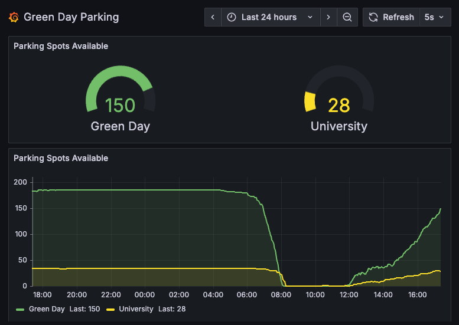

# Green Day Parking Stats
This repository contains a prometheus exporter for Green Day Parking statistics. It collects data from the gd.zaparkuj.pl and exposes it in a format that can be scraped by Prometheus.
It also includes a Grafana dashboard for visualizing the collected data.

## Links
There is a link to the publicly available Grafana dashboard: [Green Day Parking Stats](https://gd-parking.rdome.net/public-dashboards/e4ba370c0edd43f5855e4b0c27991f80?refresh=5s&from=now-12h&to=now&timezone=browser)

